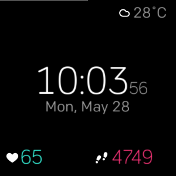

# Minimal Clock

*[Available at the Fitbit App Gallery](https://gam.fitbit.com/gallery/clock/49782df6-255f-4483-80b0-de2627b72df0)*

This provides a minimalistic clock face for the *Fitbit Versa* that displays
the following things:

- time/date/weekday
- color-coded *step count* (red: <50% of daily goal, yellow: >50% but <100%, green: ≥100%)
- color-coded *heart rate* (greenish: normal HR, yellow: fat-burn, red: cardio/peak)
- the local weather as grabbed from *Yahoo Weather* every 30 minutes.
- the battery level as a horizontal line on top of the display

## Assets
The icons are taken from the [*Fitbit SDK Design Assets*](https://github.com/Fitbit/sdk-design-assets/)
and the [Climacons by Adam Whitcroft](https://github.com/AdamWhitcroft/Climacons/).

## Support & Contributing
If you find a bug please submit a PR/report an issue. Or be in touch via bgreshake@gmail.com / @gedankenstuecke on Twitter.
