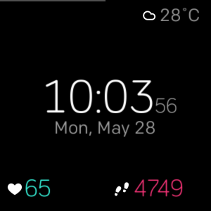

.. Minimal-Clock documentation master file, created by
   sphinx-quickstart on Fri Dec 14 15:22:30 2018.
   You can adapt this file completely to your liking, but it should at least
   contain the root `toctree` directive.

Welcome to Minimal-Clock's documentation!
=========================================

``Minimal-Clock`` is a clockface for the `Fitbit Versa Smart Watch <https://www.fitbit.com/versa>`_.

It is `available from the Fitbit App Gallery <https://gam.fitbit.com/gallery/clock/49782df6-255f-4483-80b0-de2627b72df0>`_
(You will need to visit the App Gallery link with your Smartphone for it to work).

This provides a minimalistic clock face for the Fitbit Versa that displays the following things:

* time/date/weekday
* color-coded step count (red: <50% of daily goal, yellow: >50% but <100%, green: ≥100%)
* color-coded heart rate (greenish: normal HR, yellow: fat-burn, red: cardio/peak)
* the local weather with temperature in Celsius or Fahrenheit as grabbed from Yahoo Weather every 30 minutes.
* the battery level as a horizontal grey line on top of the display

.. toctree::
   :maxdepth: 2
   :caption: Contents:

   faq
   contact
